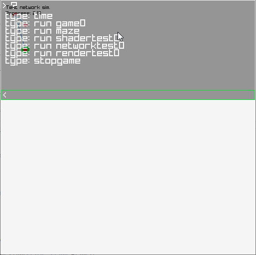
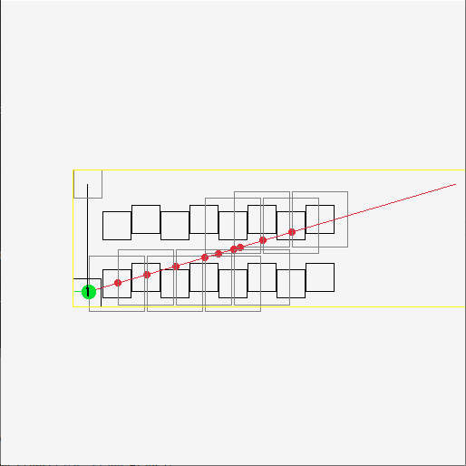
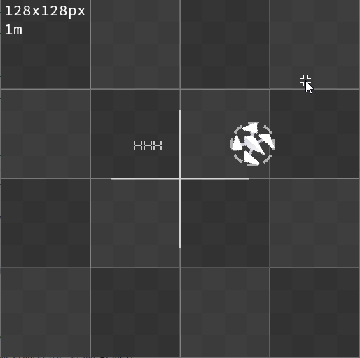
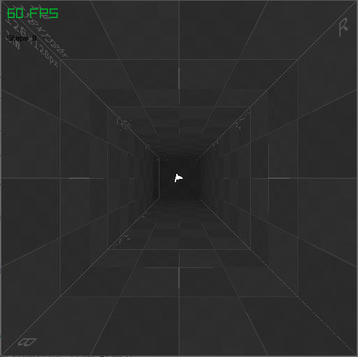
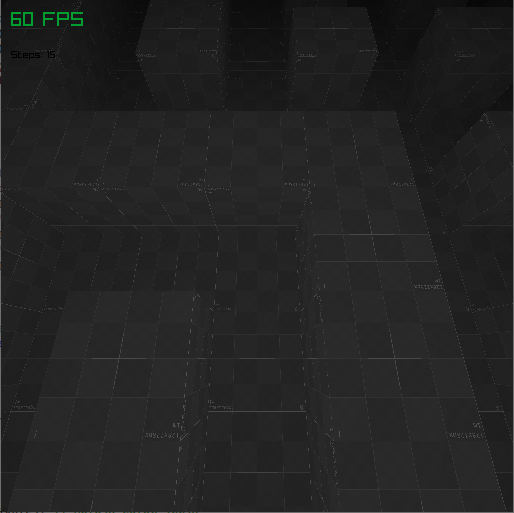
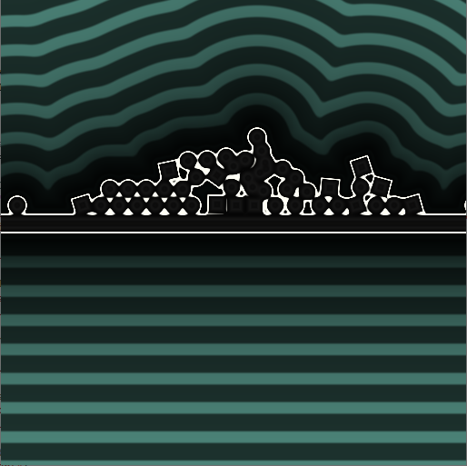
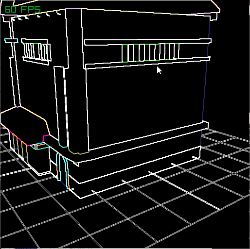
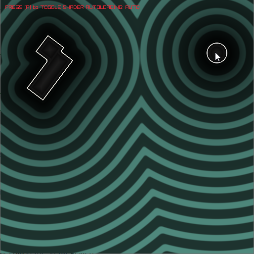

<a href="https://tynr.art/#fullscreen">

</a>

1. Заменить все ассеты kenney на хендмейд
2. [+] ссылку по картинке на tynr.art добавить (.mdджутсу)
3. 
 










# tem

- Had to add `include_directories(extern/simde)` line into `external/box2c/CMakeLists.txt` to build it properly
- Didn't test build .sh scripts for a while

Demo at [ctynbox](https://ctynbox.netlify.app).
Prev version on [guthub](https://github.com/tynrare/tynbox/tree/d240509).
Prev version on [gitlab](https://gitlab.com/tynrare/dust-220624).


# build 

raylib build for web:

```
emcc -c rcore.c -Os -Wall -DPLATFORM_WEB -DGRAPHICS_API_OPENGL_ES3
emcc -c rshapes.c -Os -Wall -DPLATFORM_WEB -DGRAPHICS_API_OPENGL_ES3
emcc -c rtextures.c -Os -Wall -DPLATFORM_WEB -DGRAPHICS_API_OPENGL_ES3
emcc -c rtext.c -Os -Wall -DPLATFORM_WEB -DGRAPHICS_API_OPENGL_ES3
emcc -c rmodels.c -Os -Wall -DPLATFORM_WEB -DGRAPHICS_API_OPENGL_ES3                                                                                                                                                                    
emcc -c utils.c -Os -Wall -DPLATFORM_WEB
emcc -c raudio.c -Os -Wall -DPLATFORM_WEB

emar rcs libraylib.a rcore.o rshapes.o rtextures.o rtext.o rmodels.o utils.o raudio.o
```
